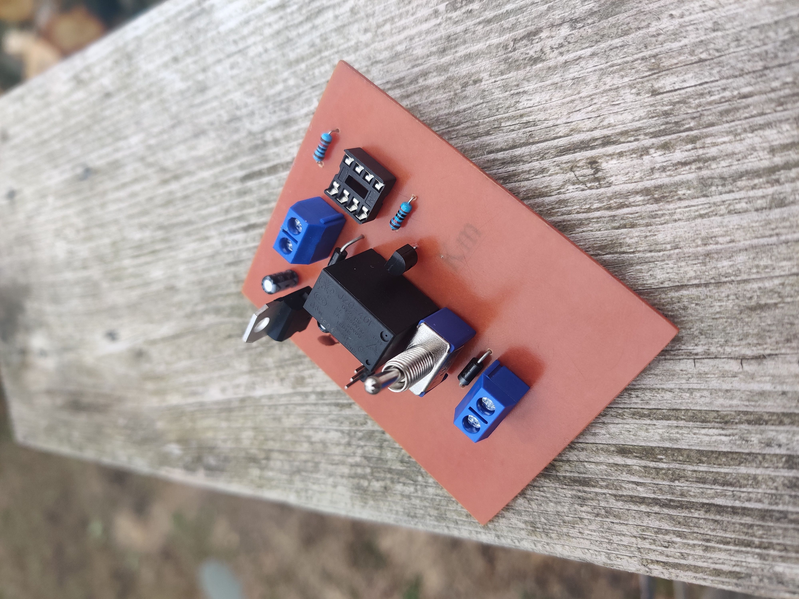
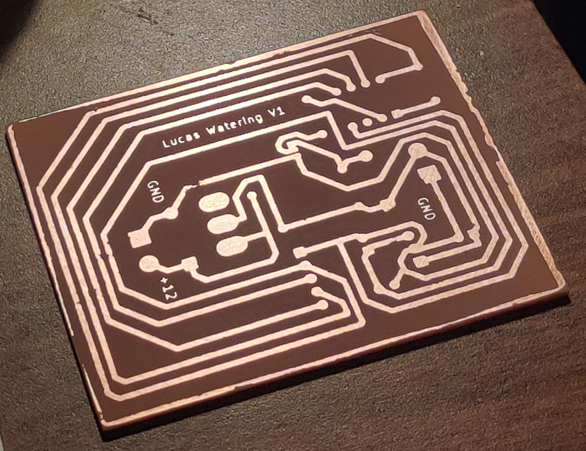

# IrrigationAutomation
This is a simple program that works with an Arduino, RTC, relays and a solenoid to automate the watering of a garden. This project runs off of a battery charged by a solar pannel and uses gravity to feed to water to the plants.

**Goals:**  
- [x] Redesign the PCB with custom Micro-Controller and relay board  
- [ ] Add a schematic diagram to this page  
- [ ] Add soil detection features to check moisture, temp and other stats   

**BOM: Needs to be updated with schematic and PCB design files**  

- Arduino UNO or ATmega328 or ATtiny 85  
- 12V relay 
- Silicon Diode  
- DS3231 RTC module  
- Solenoid Valve  
- Solar Pannel  
- 12V Lead acid battery or other 12V Lithium battery System  
- Solar charge controller  

